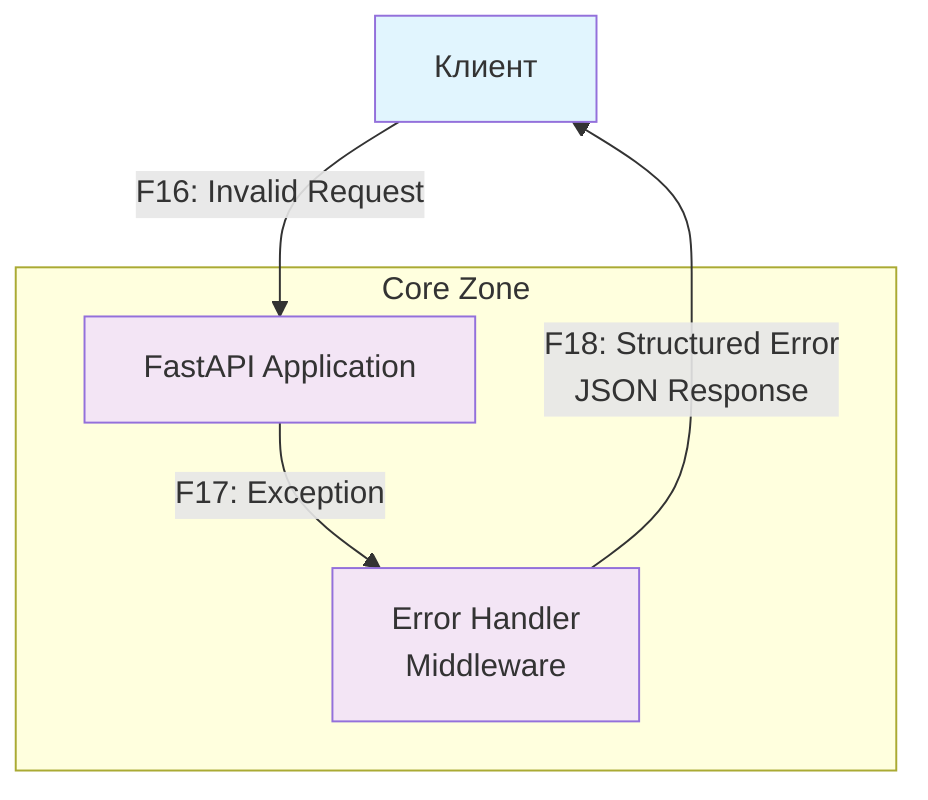

# Data Flow Diagram (DFD)

## Основной сценарий

```mermaid
graph TD
    %% Внешние участники
    Client[Клиент<br/>Web Browser]

    %% Границы доверия
    subgraph Edge["Edge Zone<br/>(DMZ/Proxy)"]
        LB[Load Balancer<br/>Reverse Proxy]
    end

    subgraph Core["Core Zone<br/>(Application)"]
        API[FastAPI Application<br/>Port 8000]
        Auth[Authentication<br/>Middleware]
        Validation[Input Validation<br/>Middleware]
    end

    subgraph Data["Data Zone<br/>(Storage)"]
        MemoryDB[(In-Memory Database<br/>Items Storage)]
    end

    %% Потоки данных
    Client -->|F1: HTTP/HTTPS<br/>GET /health| LB
    Client -->|F2: HTTP/HTTPS<br/>POST /items| LB
    Client -->|F3: HTTP/HTTPS<br/>GET /items/{id}| LB

    LB -->|F4: HTTP<br/>Health Check| API
    LB -->|F5: HTTP<br/>Create Item| API
    LB -->|F6: HTTP<br/>Get Item| API

    API -->|F7: Health Status| LB
    API -->|F8: Item Data| LB
    API -->|F9: Error Response| LB

    API -->|F10: Store Item| MemoryDB
    API -->|F11: Query Item| MemoryDB
    MemoryDB -->|F12: Item Data| API

    %% Обработка ошибок
    API -->|F13: Validation Error| Validation
    API -->|F14: Not Found Error| API
    Validation -->|F15: Error Response| API

    %% Стилизация
    classDef external fill:#e1f5fe
    classDef edge fill:#fff3e0
    classDef core fill:#f3e5f5
    classDef data fill:#e8f5e8

    class Client external
    class LB edge
    class API,Auth,Validation core
    class MemoryDB data
```

## Альтернативный сценарий (Обработка ошибок)



## Описание потоков данных

| ID | Описание | Протокол | Направление | Данные |
|----|----------|----------|-------------|--------|
| F1 | Health check запрос | HTTP/HTTPS | Client → Edge | GET /health |
| F2 | Создание элемента | HTTP/HTTPS | Client → Edge | POST /items?name=... |
| F3 | Получение элемента | HTTP/HTTPS | Client → Edge | GET /items/{id} |
| F4 | Проксирование health check | HTTP | Edge → Core | Health request |
| F5 | Проксирование создания | HTTP | Edge → Core | Create request |
| F6 | Проксирование получения | HTTP | Edge → Core | Get request |
| F7 | Ответ health check | HTTP | Core → Edge | {"status": "ok"} |
| F8 | Данные элемента | HTTP | Core → Edge | Item JSON |
| F9 | Ошибка | HTTP | Core → Edge | Error JSON |
| F10 | Сохранение элемента | Internal | Core → Data | Item object |
| F11 | Запрос элемента | Internal | Core → Data | Item ID |
| F12 | Данные элемента | Internal | Data → Core | Item object |
| F13 | Ошибка валидации | Internal | Core → Core | Validation error |
| F14 | Ошибка "не найдено" | Internal | Core → Core | Not found error |
| F15 | Структурированная ошибка | Internal | Core → Core | Error response |
| F16 | Некорректный запрос | HTTP/HTTPS | Client → Core | Invalid request |
| F17 | Исключение | Internal | Core → Core | Exception object |
| F18 | Структурированная ошибка | HTTP/HTTPS | Core → Client | Error JSON |

## Компоненты системы

### Внешние участники
- **Клиент (Web Browser)**: Пользователь, взаимодействующий с API через веб-браузер

### Границы доверия
- **Edge Zone**: Зона периметра с reverse proxy/load balancer
- **Core Zone**: Зона приложения с бизнес-логикой
- **Data Zone**: Зона хранения данных

### Хранилища данных
- **In-Memory Database**: Временное хранение элементов в памяти приложения

### Протоколы и каналы
- **HTTP/HTTPS**: Внешний трафик между клиентом и edge
- **HTTP**: Внутренний трафик между edge и core
- **Internal**: Внутренние вызовы между компонентами приложения
